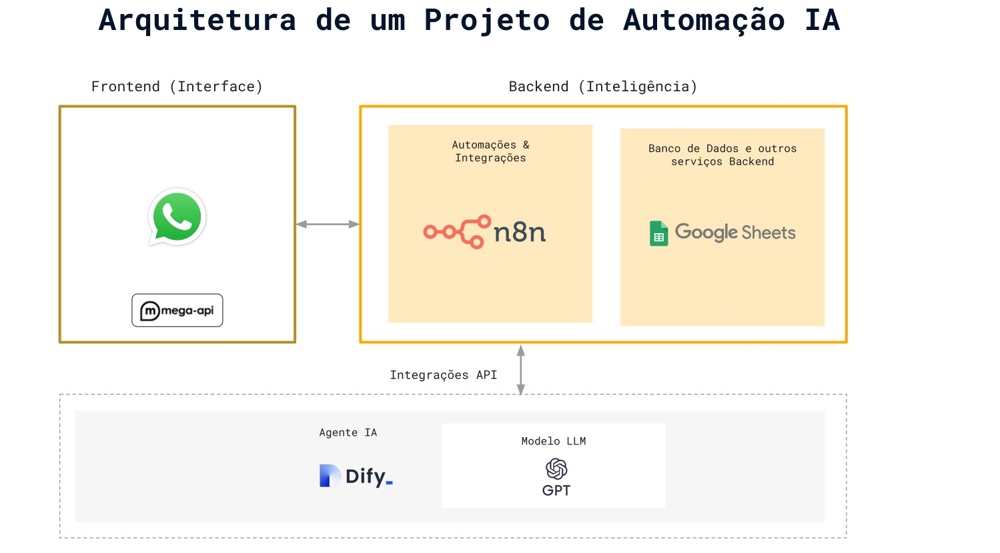

# Auto Mensagem

## O Auto Mensagem é um projeto inovador focado em automatizar o atendimento ao cliente utilizando inteligência artificial. 

Ele integra diversos serviços poderosos para criar um fluxo de atendimento eficiente e inteligente, 
proporcionando uma experiência otimizada para o usuário.

## Funcionalidades Principais:

- Atendimento Inteligente: Utiliza a IA do OpenAI, integrada através do Dify.ai, para interpretar as mensagens dos 
clientes e fornecer respostas relevantes e personalizadas.

- Funil de Processamento: O n8n orquestra o fluxo de dados, criando um funil de processamento que garante a 
organização e o direcionamento correto das informações.

- Armazenamento Seguro: O Supabase é utilizado para armazenar dados importantes dos 
clientes, como telefone, e-mail, nome, entre outros, garantindo a segurança e a integridade das informações.

## Arquitetura:

O projeto funciona da seguinte forma:

1. Um cliente envia uma mensagem.
2. O Dify.ai recebe a mensagem e a processa com a IA do OpenAI.
3. O n8n recebe os dados processados pelo Dify.ai.
4. O n8n executa um fluxo de trabalho (workflow) que inclui:
- Extração de informações relevantes da mensagem (telefone, e-mail, nome, etc.).
- Armazenamento dessas informações no Supabase.
- Retorno da resposta gerada pela IA para o cliente.

## Tecnologias Utilizadas:

1. Dify.ai: Plataforma para integrar e gerenciar aplicações de IA, incluindo a integração com o OpenAI.
2. OpenAI: Modelo de linguagem avançado para processamento de linguagem natural e geração de respostas inteligentes.
3. n8n: Ferramenta de automação de fluxo de trabalho (workflow) para orquestrar a integração entre os serviços.
4. Supabase: Plataforma de banco de dados open-source que oferece funcionalidades como 
banco de dados PostgreSQL, autenticação, armazenamento e APIs em tempo real.
5. Evolution (especificar qual serviço): Inclua uma breve descrição de como o 
Evolution é utilizado no projeto. Exemplo: "Evolution (API de Mensagens): 
Responsável pelo envio e recebimento de mensagens através de diferentes canais." 
(Caso seja uma API de mensagens). Caso não haja um serviço chamado "Evolution" ou você tenha se enganado, remova essa linha

## Objetivo:

O principal objetivo do Auto Mensagem é automatizar e otimizar o atendimento ao cliente, 
proporcionando respostas rápidas, personalizadas e eficientes, além de coletar e armazenar 
informações relevantes para melhorar o relacionamento com o cliente.

Auto Mensagem by Lider Comercer